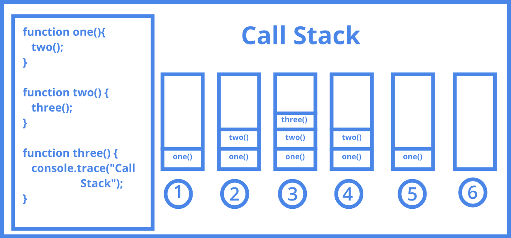

# Notes

- [JavaScript Principles](#javascript-principles)
  - [Call Stack](#call-stack)
- [Functions and callbacks](#functions-and-callbacks)
  - [Arrow functions](#arrow-functions)
- [Closure](#closure)
  - [Functions with memories](#functions-with-memories)
  - [Multiple Closure Instances](#multiple-closure-instances)
- [Asynchronous JS](#asynchronous-js)
  - [ES 5](#es-5)
  - [ES 6 - Promises](#es-6---promises)

## JavaScript Principles

-   When JS code runs, it goes through the code **line-by-line** and runs each line - know as the **thread of execution**. JS only can handle 1 thread of execution.
-   When JS code runs it saves 'data' like strings and arrays so we can use that data later - **in its memory**.
-   Functions: Code we save ('define') functions and can use (call / invoke / execute / run) later with the function's name and ().
-   **Execution context**: Created to run the code of a function. Has 2 parts: thread of execution and memory. _We need the thread of execution to call the function and the memory to take the data we're going to use and save new data. The first execution context is the global one, when we run our code. Then, we create new contexts by calling for functions and other pieces of code to execute, so we're creating contexts inside other contexts. We can see the relation between this and the scope_.

> [!NOTE]
>
> -   **Parameter VS Argument 🪙**. For the function `function multiplyBy2(inputNumber) {}`, been the inputNumber 3, `inputNumber` is the parameter, while 3 is the argument. The parameter is sort of the placeholder that awaits, it's gonna receive the value when the function it's being run. And that value is the argument.
>
> -   **Value**: anything that is stored.

### Call Stack



-   JS keeps track of what function is currently running (where's the thread of execution)
-   Run a function → add to call stack
-   Finish running the function → Removes it from call stack
-   Whatever is top of the call stack → That's the function we're currently running.
-   When it finishes, it comes back to `global()`.

## Functions and callbacks

DRY principle: Don't Repeat Yourself

In JS **functions are First Class Objects** (meaning that everything that objects have, functions have too; they're full features of objects, meaning they can be treated just like objects). So we can assign functions to variables and properties of other objects (methods), pass them as arguments into functions and also return functions as values from other functions.

> [!NOTE]
>
> **High Order Function**.
>
> The outer function that _takes in_ or passes out a function.
>
> It's just a term to describe these functions - any function that does it we call that - but there's nothing different about them inherently.
>
> **Callback Function**
>
> The function we insert.

```js
//High Order Function
function copyArrayAndManipulate(array, instructions) {
    const output = []
    for (let i = 0; i < array.length; i++) {
        // Callback
        output.push(instructions(array[i]))
    }
    return output
}

function multiplyBy2(input) {
    return input * 2
}

const result = copyArrayAndManipulate([1, 2, 3], multiplyBy2)
```

**High Order Functions and Callback simplify our code and keep it DRY**. This ensures that we can write more declarative, more readable code as well. Callbacks are a core aspect of async JavaScript, and are under-the-hood of promises, async/await.

### Arrow functions


```js
//High Order Function
function copyArrayAndManipulate(array, instructions) {
    const output = []
    for (let i = 0; i < array.length; i++) {
        // Callback
        output.push(instructions(array[i]))
    }
    return output
}

const result = copyArrayAndManipulate([1, 2, 3], (input) => input * 2)
```

> Anonymous and arrow functions:
>
> -   Improve immediate legibility of the code

## Closure

-   Is the most esoteric of JS concepts.
-   Enables powerful pro-level functions like 'once' and 'memoize'.
    -   Once: Function that can turn other functions into functions that are gonna run once. If they run them again, they don't work.
    -   We can achieve memoization, a core performance optimizer in.
-   Many JS design patterns including the module pattern use closure.
-   Build iterator, handle partial application and maintain state in an asynchronous world.

### Functions with memories

-   When our functions get called, we create a live store of data (called local memory, variable environment or just state) for that function's execution context. When the function finishes executing, its local memory is deleted, except the returned value.
-   _But what if our functions could hold on to live data between executions?_
-   This would let our function definitions have an associated cache/persistent memory.
-   But it all starts with us **returning a function from another function**.

Functions can be returned from other functions is JavaScript:

```js
function createFunction() {
    function multiplyBy2(num) {
        return num * 2
    }
    return multiplyBy2
}
const generatedFunc = createFunction()
const result = generatedFunc(3) //6
```

`createFunction()` only runs to assign `generatedFunc` `multiplyBy2` as its value. Then the label 'multiplyBy2' _disappears_ and if we want to use that function we might call it by `generatedFunc()`. But why are we doing this? Let's see.

```js
function outer() {
    let counter = 0
    function incrementCounter() {
        counter++
    }
    incrementCounter()
}
outer()
```

incrementCounter() is running inside of outer's execution context and creating a new one. As there it don't find counter in its local memory, it goes to outer's local memory inside its execution context. It finds the value of counter and increments it by one.

> Where you define your functions determines what data it has access to when you call it.

```js
function outer() {
    let counter = 0
    function incrementCounter() {
        counter++
    }
    return incrementCounter
}
const myNewFunction = outer()
myNewFunction()
myNewFunction()
```

We could say that this code is not well written. Because when we execute myNewFunction(), it wouldn't find counter, so it couldn't add 1 to it. Because counter won't be in its local memory. BUT when we did `const myNewFunction = outer();`, the `return incrementCounter();` didn't just return the body of incrementCounter(), the function also carried with it the local memory of its execution context, so it had attached counter = 0, like a backpack 🎒.

So when myNewFunction() first run, it looked for counter in its local memory, and it didn't find it. But then, it looked for it in its backpack 🎒, and then it found it and incremented its value. So counter = 1.

The execution context of the first myNewFunction() gets deleted. But now we run it again and we have a new execution context. So now, again, it will look for counter in the local memory of this execution context, but nothing will be found. We go to the backpack, and now its value its 2.


It stored in a hidden property `[[scope]]`. However, we cannot access that property. We cannot go to `myNewFunction.scope.counter`. The only way to get to that data is by running this function,having it refer to something not in local memory of it, and going out to the function's definition looking in its backpack and finding counter there.

With this example, we could say that if counter is bigger than 1, the function will return "sorry, you only can run me once".

If we have had another variable next to counter, but this one is never called by other functions, it wouldn't be stored at memory, as it would be a memory leak, storing things that won't be used.

JavaScript has a very particular scope rule, called lexical or static scoping. That is to say that where I save my function determines for the rest of that life, for the life of that function, whenever it gets run under whatever new label it gets, what data it will have access to when that function runs.

One (official) name for this backpack is "Closed Over Variable Environment" (Variable Environment = Local memory).
This data is persistent, is referenced (linked) by a scope property, and the rule is a lexical scope. So another name is PLSRD (Persistent Lexical Static Referenced Data). But the industry name for this is Function's **closure**. The problem is that they use the term to refer the overall concept, the notion of lexical scoping. So that's the closure, but we could say that we also have the 'backpack closure', meaning just the result of JavaScript being a lexically scoped language.

Extra note: If the outer function returned an array of functions or an object with various methods, all those functions would have access to the same backpack.

### Multiple Closure Instances

```js
function outer() {
    let counter = 0
    function incrementCounter() {
        counter++
    }
    return incrementCounter
}

const myNewFunction = outer()
myNewFunction()
myNewFunction()

const anotherFunction = outer()
anotherFunction()
anotherFunction()
```

In this case, if we have had something like `console.log(counter)`, we would have seen 1, 2 (myNewFunction), 1 and 2 (anotherFunction), as they have different backpacks.

**Individual backpacks**. If we run 'outer' again and store the returned 'incrementCounter' function definition in 'anotherFunction', this new incrementCounter function was created in a new execution context and therefore has a brand new independent backpack.

> **Closure gives our functions persistent memories and entirely new toolkit for writing professional code**.
>
> -   **Helper functions**: Everyday professional helper functions like ‘once’ and ‘memoize’. _Like in a winning function, which should run only once, or giving our functions persistent memories of their previous input output combinations_.
>
> -   **Iterators and generators**: Which use lexical scoping and closure to achieve the most contemporary patterns for handling data in JavaScript
>
> -   **Module pattern**: Preserve state for the life of an application without polluting the global namespace
>
> -   **Asynchronous JavaScript**: Callbacks and Promises rely on closure to persist state in an asynchronous environment

## Asynchronous JS

### ES 5

-   **Promises, Async & the Event Loop**
    -   **Promises** - the most significant ES6 feature
    -   **Asynchronicity** - the feature that makes dynamic web applications possible
    -   **The event loop** - JavaScript’s triage
    -   Microtask queue, Callback queue and Web Browser features (APIs)
-   **Asynchronicity is the backbone of modern web development in JavaScript yet..**.
    -   JavaScript is:
        -   Single threaded (one command runs at a time)
        -   Synchronously executed (each line is run in order the code appears)
    -   So what if we have a task:
        -   Accessing Twitter’s server to get new tweets that takes a long time
        -   Code we want to run using those tweets
    -   Challenge: We want to wait for the tweets on Twitter (X) to be stored in tweets so that they’re there to run displayTweets on - but no code can run in the meantime.

```js
//Slow function blocks further code running

const tweets = getTweets('http://twitter.com/will/1')

// ⛔350ms wait while a request is sent to Twitter HQ
displayTweets(tweets)

// more code to run
console.log('I want to runnnn!')
```

**What if we try to delay a function directly using setTimeout?** `setTimeout` is a built in function - its first argument is the function to delay followed by ms to delay by.

```js
function printHello() {
    console.log('Hello')
}
setTimeout(printHello, 1000)
console.log('Me first!')
```

In what order will our console logs appear? 1º) Me First, 2º) Hello.

```js
function printHello() {
    console.log('Hello')
}
setTimeout(printHello, 0)
console.log('Me first!')
```

In what order will our console logs appear? 1º) Me First, 2º) Hello.

**JavaScript is not enough - We need new pieces (some of
which aren’t JavaScript at all)**

-   Our core JavaScript engine has 3 main parts:
    -   Thread of execution
    -   Memory/variable environment
    -   Call stack
-   We need to add some new components:
    -   Web Browser APIs/Node background APIs
    -   Promises
    -   Event loop, Callback/Task queue and micro task queue.

JS usually runs a in **web browser**, which has features such as the JS engine, dev tools and a console, sockets, network requests (JS cannot _speak_ to the internet), HTML DOM, a timer ⌛ and so on. The features can be used using JS through _façade_ functions, that fronts the web browser features. `setTimeOut` would be the label for the timer, and `document` would be the label to the DOM, `fetch` for the feature that makes the networks requests, `console` for the console...

```js
// 0 nanoseconds since the start of the execution
function printHello() {
    console.log('Hello')
}

// 1 nanoseconds since the start of the execution
/* JS throws that function to the browser, but nothing else, so it can go the next line.
Now this a job for the Timer feature of the browser, so it is going to start counting until 1000 ms. */
setTimeout(printHello, 1000)

// 2 nanoseconds since the beginning
/* JS asks the browser's console to print that, and it does */
console.log('Me first!')

// 1 000 000 002 nanoseconds since the start
/* Now the browser prints Hello on the screen */
```

```js
function printHello(){ console.log("Hello"); }

function blockFor1Sec(){ //blocks in the JavaScript thread for 1 sec, we could think of it as a for loop with a bunch of code }

// 0 ms
/* It triggers the browser to start that timer, it will be completed
in 0 ms, BUT it will put that function in a 'Callback Queue'
(a queue of functions) and no mater how time have passed,
functions there wont go to the Call Stack (won't be run) until
the global execution context has finished */
setTimeout(printHello,0);

// 1ms, this code will be executed
blockFor1Sec()

// 1001ms, this code will be executed
console.log("Me first!");

// 1002ms, 'hello' will be printed out.
```

🤯 You could have an infinite while loop of console.log, and the queue would never dequeue printHello. It would never even grab it and put it on the call stack.

That seems insane, but it actually **allows us to be certain of when our code will run out of a queue**.


_All regular code will run first until I ever touch anything from the queue, until I ever put anything out of the queue. So, how does JavaScript implement that?_ → **Event Loop**: tiny JS feature that checks before every single line of code run if the call stack is empty. If there's still further global code to run, then it will not even go look at the queue. But if the call stack's empty or if it heads down to the queue, it grabs the function and it puts it on the call stack.

This was asynchronous JS until ES 6.

-   **ES5 Web Browser APIs with callback functions**
    -   Problems
        -   Our response data is only available in the callback function - Callback hell
        -   Maybe it feels a little odd to think of passing a function into another function only for it to run much later
    -   Benefits
        -   Super explicit once you understand how it works under-the-hood

### ES 6 - Promises

With ES 5 solution, JS was unable to know what was happening in the web browser. JS just throws the action there and it forgets about it. With these new promises, when you trigger something in the background, don't just throw it out there. But have it have some sort of consequence in JavaScript memory as well.

-   ES 6+ solution: **Promises**. Using two-pronged ‘facade’ functions that both:
    -   Initiate background web browser work and
    -   Return a placeholder object (promise) immediately in JavaScript

```js
function display(data) {
    console.log(data)
}
const futureData = fetch('https://twitter.com/will/tweets/1')
futureData.then(display)

console.log('Me first!')
```

-   `fetch` _creates_ a **promise** object, which has properties such as `value` or `on fulfilled`. The last one is hidden and it's an array that will contain what JS should do once the request is complete. For the time now, it still isn't.
-   `fetch` will make the browser use the network request future, that will request data to Twitter. Some time after data, Twitter will answer with a **response**.
-   How will we know that request is completed? Through the method **`then`**. The function we put in `then` will be auto-run by JS and will be the value of `on fulfilled`.
-   Then the execution context goes to `console.log...`. And will be printed 'Me first' in the console.
-   Then Twitter will send us data back, let's say at 270 ms. The data is just 'hi'. 'hi' will be store in the `value` property of `futureData` and this is going to trigger `on fulfilled` property, which is the `display` function, with the input `hi` and a brand new execution context.

> -   **`then` method and functionality to call on completion**
>     -   Any code we want to run on the returned data must also be saved on the promise object.
>     -   Added using `.then` method to the hidden property ‘onFulfilment’
>     -   Promise objects will automatically trigger the attached function to run (with its input being the returned data)

But we need to know how our promise-deferred functionality gets back into JavaScript to be run...

```js
function display(data) {
    console.log(data)
}
function printHello() {
    console.log('Hello')
}
function blockFor300ms() {
    /* blocks js thread for 300ms */
}

setTimeout(printHello, 0)

const futureData = fetch('https://twitter.com/will/tweets/1')
futureData.then(display)

blockFor300ms()
console.log('Me first!')
```

What this code does?

1. First three functions are saved in the global memory.
2. We have this _façade_ function `setTimeout`. This is gonna send the duration (0 ms) to the timer feature of the web browser. It will add the function `printHello` to the **callback queue** on completion of the time, so it will add it now.
3. Declaration of `futureData` and saved on the global memory.
    1. This is a two-pronged façade function. It has a JS-related part and another related to the browser and its feature to make network requests:
    2. JS part
        1. `fetch` will do a network request through the browser
        2. `fetch` creates an special object, a **promise**. This object will the value of `futureData` stored in the global memory.
        3. Some of the properties of this promise will be `value` and `onfulfilled`, which is an array. As soon as `value` gets updated it will trigger the function stored in the `onfulfilled` array.
    3. Browser part
        1. Network request. We need the URL and its two parts: domain (`twitter.com`) and directory (`/will/1`).
        2. We don't know when the request will be completed, but when it does, whatever get's back from it will be stored in `futureData.value`.
    4. When value gets updated, the `then` method will automatically put the given function `display` into `onfulfilled`, it will go to the **MICROTASK QUEUE** (instead of the function queue) and after some time it will run it.
4. We run `blockFor300ms`, creating a new execution context.
    1. During this time, we'll receive a tweet from Twitter, 'hi'. When all global codes finish running, this will be stored on `futureData.value`.
5. The console will print 'Me first!'.
    1. After this the call stack will be empty. We'll have the 'callback queue' with the `printHello` function and the 'microtask queue' with the `display` function. So what will happen now?
6. `display` function will be executed, as microtask queue goes first. 'hi' will be printed.
7. `printHello' function will be executed at last, despite of being the first function in the code lines. It finally will jump into the call stack and 'Hello' will be printed out.

[MDN Web APIS](https://developer.mozilla.org/en-US/docs/Web/API) (docs of what we're calling _façade_ functions).

_What items go into the microtask queue and what items go into the callback queue?_ Any function that is attached to a promise object → micro-task. Any function that's passed in directly through a facade function that triggers a web browser feature (like the timer) → callback queue.

-   **Promises**
    -   Problems
        -   99% of developers have no idea how they’re working under the hood.
        -   Debugging becomes super-hard as a result.
        -   Developers fail technical interviews.
    -   Benefits
        -   Cleaner readable style with pseudo-synchronous style code.
        -   Nice error handling process. ↓

There's another property inside the promise object, `on rejection`. It is common to suffer errors when working with network requests. This is also an array. So if we receive an error, the function that will be run will be the one stored on `on rejection`. We'll store it there with `futureData.catch()`.

> **We have rules for the execution of our asynchronously delayed code**
>
> Hold promise-deferred functions in a microtask queue and callback function in a task queue (Callback queue) when the Web Browser Feature (API) finishes
> Add the function to the Call stack (i.e. run the function) when:
>
> -   Call stack is empty & all global code run (Have the Event Loop check this condition)
>
> Prioritize functions in the microtask queue over the Callback queue

**Promises, Web APIs, the Callback & Microtask Queues and Event loop enable**:
- **Non-blocking applications**: This means we don’t have to wait in the single thread and don’t block further code from running
- **However long it takes**: We cannot predict when our Browser feature’s work will finish so we let JS handle automatically running the function on its completion.
- **Web applications**: Asynchronous JavaScript is the backbone of the modern web - letting us build fast ‘non-blocking’ applications